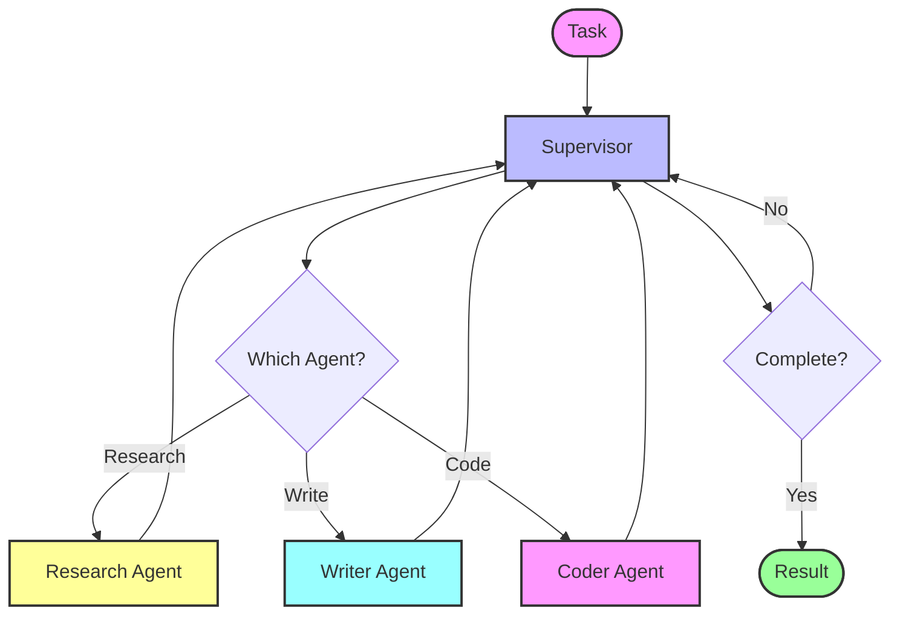

# Multi-Agent Architecture

This folder demonstrates **Multi-Agent Systems** where multiple specialized agents collaborate to solve complex tasks.

## Overview

Multi-agent architectures allow:
- **Specialization**: Each agent focuses on specific tasks.
- **Collaboration**: Agents work together to achieve a common goal.
- **Scalability**: Complex workflows can be broken into manageable pieces.

## Examples

### 1. Subgraphs (`1_subgraphs.ipynb`)
Demonstrates using **subgraphs**:
- Create modular, reusable agent components.
- Compose smaller graphs into larger workflows.
- Each subgraph can be independently tested and maintained.

### 2. Supervisor Multi-Agent Workflow (`2_supervisor_multiagent_workflow.ipynb`)
Implements a **supervisor pattern**:
- **Supervisor Agent**: Coordinates and routes tasks to specialist agents.
- **Worker Agents**: Handle specific subtasks (e.g., research, writing, coding).
- Supervisor decides which agent to invoke based on task requirements.

## Flow Visualization - Supervisor Pattern

## How to Run

Open the notebooks in Jupyter or VS Code to execute the examples.
