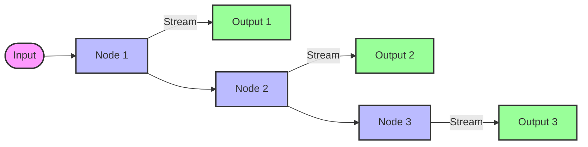

# Streaming

This folder demonstrates **streaming** in LangGraph for real-time output.

## Overview

Streaming allows you to:
- **Display intermediate results** as the agent works.
- **Improve user experience** by showing progress in real-time.
- **Debug workflows** by observing each step as it happens.

## Example

### Stream Events (`1_stream_events.ipynb`)
Demonstrates event streaming:
- Stream **node outputs** as they are generated.
- Stream **LLM tokens** for real-time text generation.
- Stream **tool calls** and their results.

## Streaming Modes

LangGraph supports several streaming modes:

### 1. `stream()` - Stream Node Outputs
Yields the output of each node as it completes:
```python
for chunk in app.stream(inputs):
    print(chunk)
```

### 2. `stream_events()` - Stream All Events
Streams detailed events including:
- LLM token generation
- Tool invocations
- Node starts/ends
- State updates

### 3. `astream_events()` - Async Streaming
For async applications with real-time updates.

## Flow Visualization



## How to Run

Open `1_stream_events.ipynb` in Jupyter or VS Code to see streaming in action.
