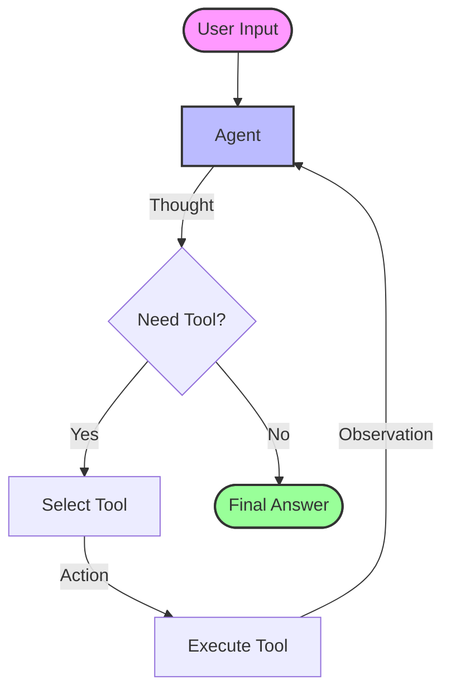

# Introduction to ReAct Agents

This folder contains a basic example of a **ReAct (Reasoning and Acting)** agent implemented using LangChain.

## Overview

The ReAct pattern allows an agent to:
1.  **Reason** about a task (Thought).
2.  **Act** by using tools (Action).
3.  **Observe** the output of the tool (Observation).
4.  Repeat until a final answer is reached.

## Code Structure

- `react_agent_basic.py`: The main script that initializes and runs the agent.

### Tools Used
1.  **TavilySearchResults**: A search engine tool for fetching real-time information.
2.  **get_system_time**: A custom tool that returns the current system time.

## Flow Visualization

The following diagram illustrates the ReAct loop used in this example:



## How to Run

```bash
python react_agent_basic.py
```
