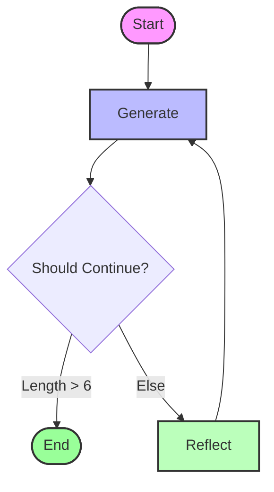

# Basic Reflection System

This folder contains an example of a **Reflection Agent** implemented using LangGraph.

## Overview

A Reflection Agent improves its outputs by critiquing its own work. It consists of two main components:
1.  **Generator**: Produces an initial output (e.g., a tweet).
2.  **Reflector**: Critiques the output and provides recommendations for improvement.

The cycle continues for a fixed number of steps or until a criteria is met.

## Code Structure

- `basic.py`: Defines the LangGraph workflow, nodes, and edges.
- `chains.py`: Contains the LLM chains for generation and reflection using `ChatOpenAI` (GPT-4o).

### Nodes
- **GENERATE**: Generates content based on the user request and previous critiques.
- **REFLECT**: Generates a critique of the content produced by the GENERATE node.

## Flow Visualization

The agent follows a cyclic graph where it generates content, reflects on it, and then regenerates it based on the reflection.



## How to Run

```bash
python basic.py
```
