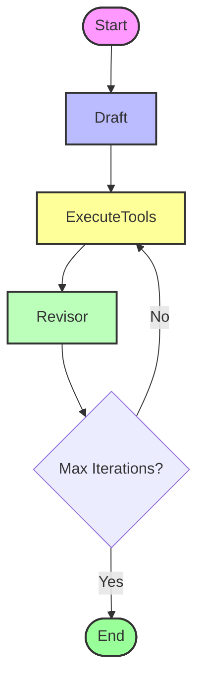

# Reflexion Agent System

This folder contains an implementation of a **Reflexion Agent** using LangGraph.

## Overview

Reflexion is a framework that reinforces language agents through linguistic feedback. Unlike the basic reflection agent, this system includes an **external tool execution step** to gather information for improvement.

The process involves:
1.  **Draft**: The agent generates an initial answer and search queries.
2.  **Execute Tools**: The system executes the search queries using Tavily.
3.  **Revise**: The agent revises its answer based on the search results and its own reflection.
4.  **Loop**: This cycle repeats for a specified number of iterations.

## Code Structure

- `reflexion_graph.py`: Defines the main LangGraph workflow.
- `chains.py`: Contains the `first_responder` and `revisor` chains.
- `execute_tools.py`: Handles the execution of search queries using `TavilySearchResults`.
- `schema.py`: Defines the Pydantic models for structured output (`AnswerQuestion`, `ReviseAnswer`).

## Flow Visualization



## How to Run

```bash
python reflexion_graph.py
```
