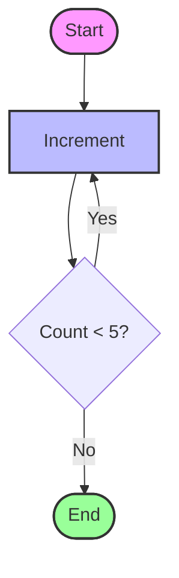

# State Deep Dive

This folder explores how **State** is managed in LangGraph.

## Overview

LangGraph uses a `State` object to pass information between nodes. This state can be simple (replaced at each step) or complex (aggregated using reducers).

## Code Structure

- `1_basic_state.py`: Demonstrates a simple state where updates **overwrite** the existing value.
- `2_complex_state.py`: Demonstrates a complex state using `Annotated` and **reducers** (like `operator.add` and `operator.concat`) to accumulate values.

## Examples

### Basic State (Overwrite)
```python
class SimpleState(TypedDict):
    count: int

# Returning {"count": 1} replaces the old count with 1
```

### Complex State (Reducers)
```python
class SimpleState(TypedDict):
    count: int
    sum: Annotated[int, operator.add]
    history: Annotated[List[int], operator.concat]

# Returning {"sum": 1} adds 1 to the existing sum
# Returning {"history": [1]} appends [1] to the existing history
```

## Flow Visualization

Both examples follow a simple loop:



## How to Run

```bash
python 1_basic_state.py
python 2_complex_state.py
```
