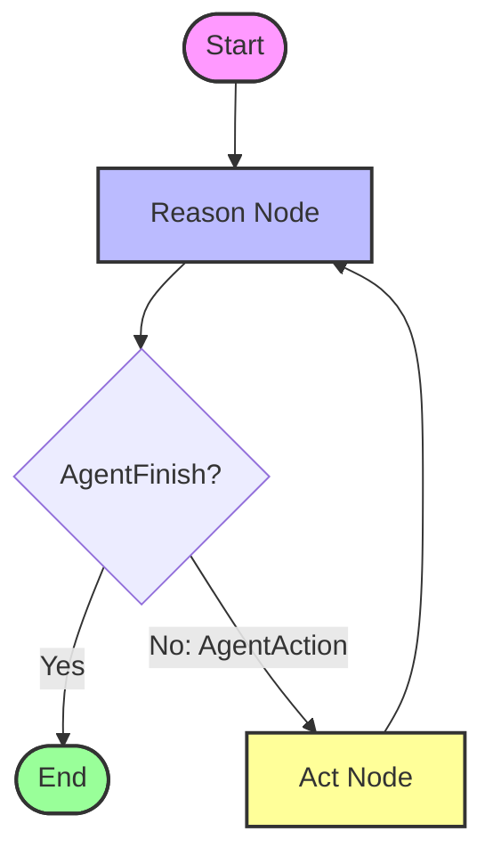

# ReAct Agent

This folder demonstrates a complete implementation of a **ReAct (Reasoning and Acting) Agent** using LangGraph with custom nodes and state management.

## Overview

Unlike the basic version in `1_Introduction`, this implementation uses **LangGraph's StateGraph** to explicitly define the reasoning and acting loops. The agent:
1.  **Reasons**: Uses the LLM to decide what action to take.
2.  **Acts**: Executes the chosen tool.
3.  **Observes**: Records the output and repeats until finished.

## Code Structure

- `react_graph.py`: Defines the LangGraph workflow with nodes and edges.
- `nodes.py`: Contains the `reason_node` (invokes the agent) and `act_node` (executes tools).
- `agent_reason_runnable.py`: Creates the ReAct agent runnable using `create_react_agent`.
- `react_state.py`: Defines the `AgentState` TypedDict for state management.

## Agent State

```python
class AgentState(TypedDict):
    input: str  # User's query
    agent_outcome: Union[AgentAction, AgentFinish, None]  # Current decision
    intermediate_steps: Annotated[list[tuple[AgentAction, str]], operator.add]  # History
```

## Flow Visualization



## How to Run

```bash
python react_graph.py
```
