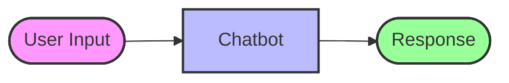
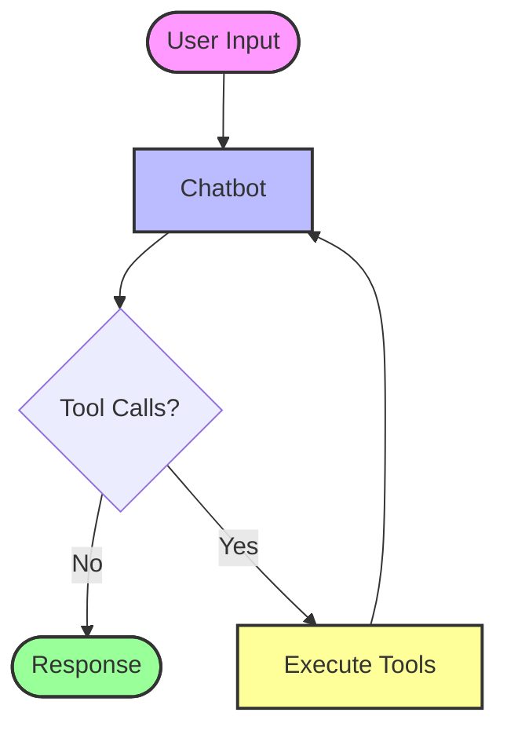

# Chatbot

This folder demonstrates how to build **chatbots** using LangGraph with progressive enhancements.

## Overview

The examples progress from a basic chatbot to one with tools and persistent memory using checkpointers.

## Examples

### 1. Basic Chatbot (`1_basic_chatbot.py`)
A simple chatbot that:
- Takes user input in a loop.
- Invokes the LLM with the latest message.
- Has **no memory** between turns.

### 2. Chatbot with Tools (`2_chatbot_with_tools.py`)
Adds tool-calling capabilities:
- Uses `TavilySearchResults` for web search.
- Routes to `ToolNode` when tools are called.
- Still has **no memory** between conversations.

### 3. In-Memory Checkpointer (`3_chat_with_in_memory_checkpointer.py`)
Adds conversation memory:
- Uses `MemorySaver` to store chat history in memory.
- Maintains context across multiple turns.
- Memory is **lost when the program exits**.

### 4. SQLite Checkpointer (`4_chat_with_sqlite_checkpointer.py`)
Adds persistent memory:
- Uses `SqliteSaver` to store chat history in a SQLite database.
- Memory **persists across program restarts**.

## Flow Visualization - Basic Chatbot



## Flow Visualization - Chatbot with Tools



## How to Run

```bash
python 1_basic_chatbot.py
python 2_chatbot_with_tools.py
python 3_chat_with_in_memory_checkpointer.py
python 4_chat_with_sqlite_checkpointer.py
```
