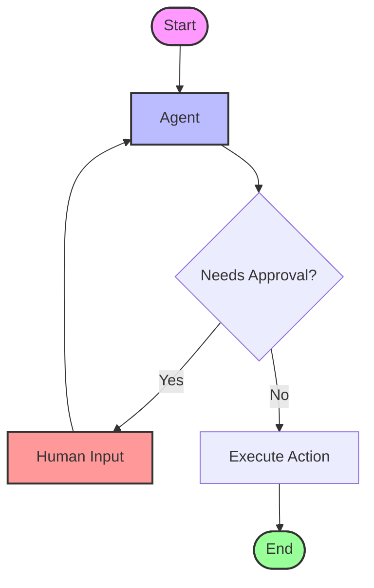

# Human-in-the-Loop

This folder demonstrates various **Human-in-the-Loop (HITL)** patterns for building interactive agents.

## Overview

Human-in-the-loop allows agents to pause execution and request human input or approval before proceeding. This is crucial for:
- Validating critical decisions
- Providing additional context
- Overriding agent actions

## Examples

### 1. Using `input()` (`1_using_input().py`)
The simplest approach:
- Uses Python's built-in `input()` function to pause execution.
- Requests user confirmation before executing tools.

### 2. Command Pattern (`2_command.ipynb`)
Uses LangGraph's `Command` API:
- Programmatically control graph execution.
- Return specific commands to route the workflow.

### 3. Resume Pattern (`3_resume.ipynb`)
Demonstrates pausing and resuming:
- Interrupt execution using `interrupt()`.
- Resume from checkpoints with additional input.

### 4. Approval Pattern (`4_approval.ipynb`)
Implements an approval workflow:
- Agent proposes actions.
- Human approves or rejects.
- Graph continues based on approval.

### 5. Multi-turn Conversation (`5_multiturn_conversation.py`)
Complex multi-turn interaction:
- Maintains conversation context.
- Allows humans to guide the agent through multiple steps.

## Flow Visualization



## How to Run

```bash
python 1_using_input().py
# For notebooks, open in Jupyter or VS Code
```
