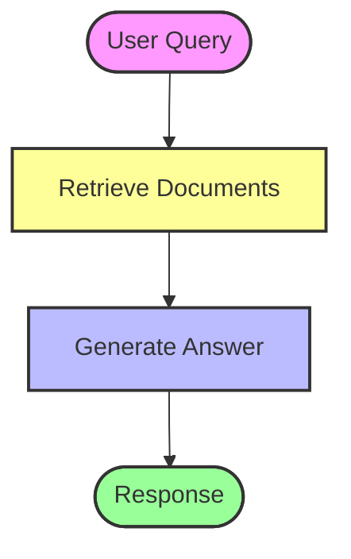
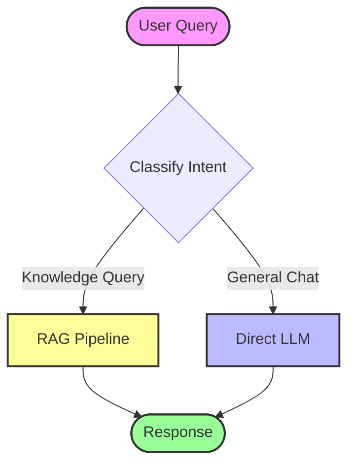

# RAG Agent

This folder demonstrates various **Retrieval-Augmented Generation (RAG)** patterns for building knowledge-based agents.

## Overview

RAG agents combine document retrieval with LLM generation to answer questions based on specific knowledge bases. These examples show progressively sophisticated RAG implementations.

## Examples

### 1. Basic RAG (`1_basic.ipynb`)
Simple RAG implementation:
- Load documents and create vector store.
- Retrieve relevant chunks.
- Generate answers using retrieved context.

### 2. Classification-Driven Agent (`2_classification_driven_agent.ipynb`)
Uses classification to route queries:
- Classify user intent (e.g., general chat vs. knowledge query).
- Route to appropriate handler (RAG vs. direct LLM).

### 3. RAG-Powered Tool Calling (`3_rag_powered_tool_calling.ipynb`)
Combines RAG with tool calling:
- RAG as a tool among other tools.
- Agent decides when to use RAG retriever.

### 4. Advanced Multi-Step Reasoning (`4_advanced_multi_step_reasoning.ipynb`)
Complex reasoning over documents:
- Multi-step retrieval and reasoning.
- Iterative refinement of answers.

## Flow Visualization - Basic RAG

## Flow Visualization - Classification-Driven

## How to Run

Open the notebooks in Jupyter or VS Code to execute the examples.
